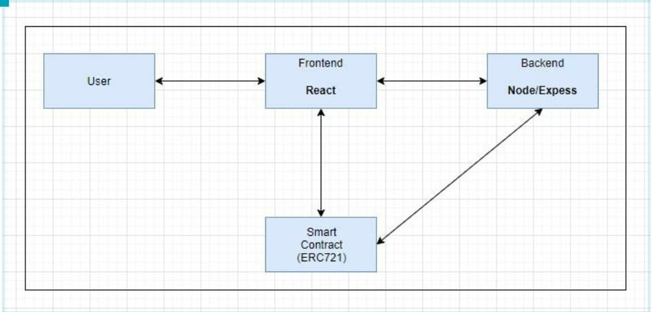
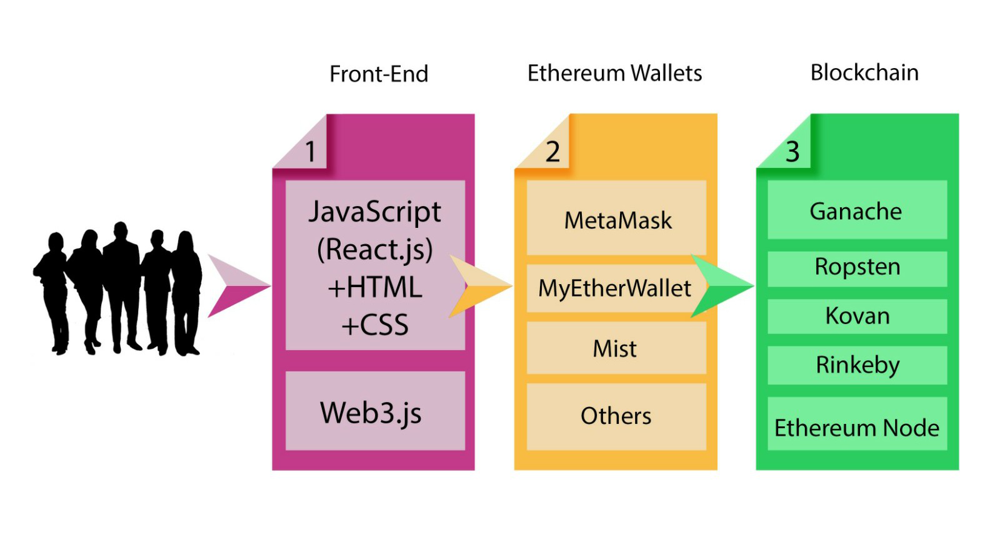
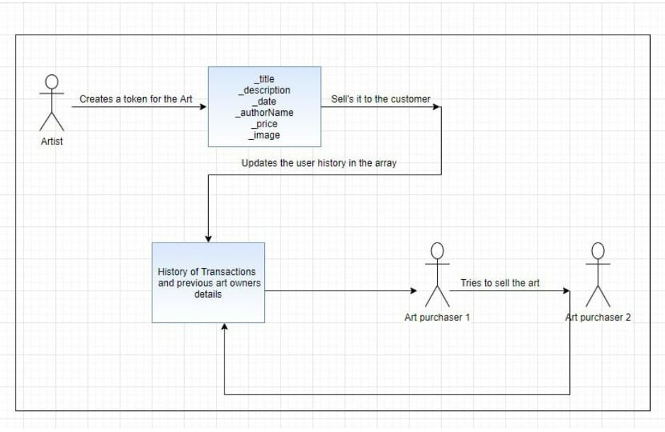
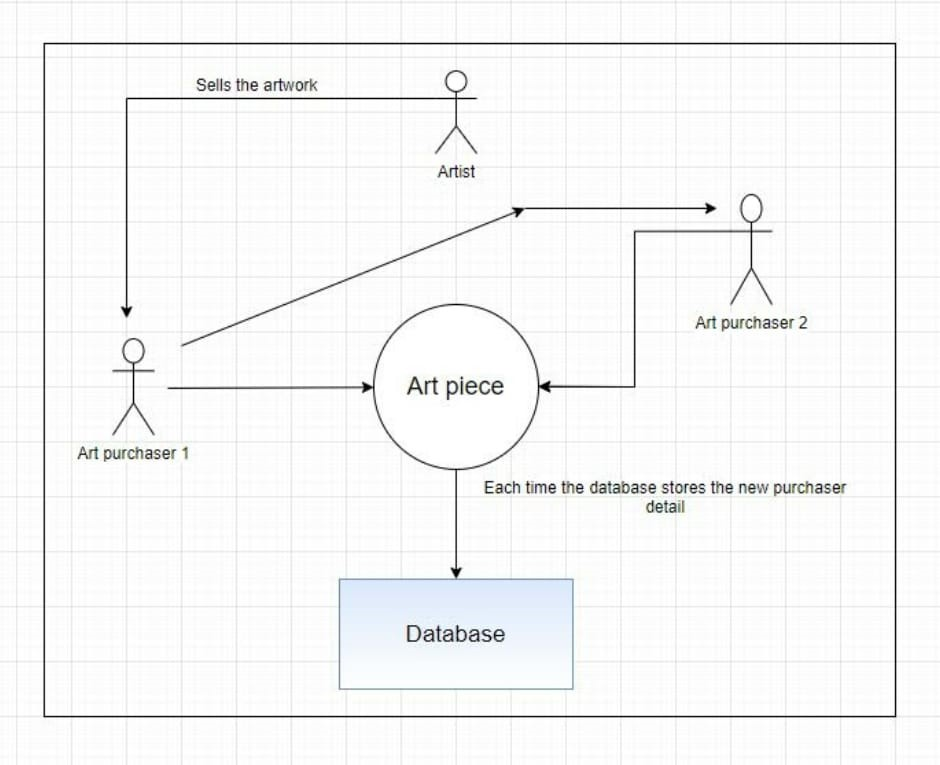
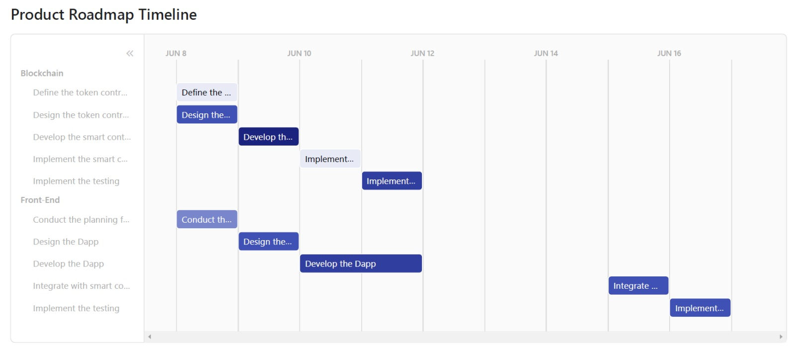
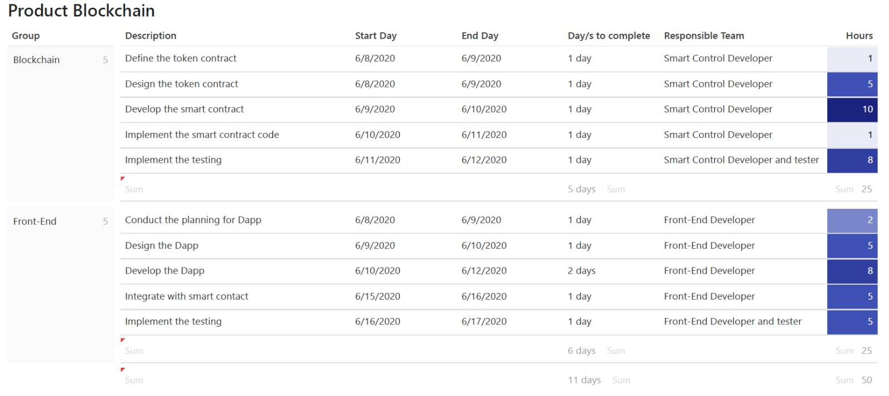
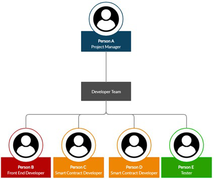

# Design Patterns for Blockchain

## Arts Provenance -- DigitalArt Token (DT)
Feiya Wang --101036160<br>
Muzammil -- 101281406<br>
Neraj Obla KumarBabu --	101275194<br>
Patterson Thamba -- 101280376<br>
Vidyavathy Venkataseshadri -- 101266772<br>

 
---

### How to deploy and test
Software requirements:
- npm/react
- ganache/truffle


### Instructions to run the app

Before running the DApp , make sure to install and run ganache-cli [make sure it is hosted in http://127.0.0.1:7545]<br/>
In the main folder ,run these followng commands

        truffle migrate
        
The smart contracts will be deployed to ganache<br/>

Navigate to dapp folder and run these commands<br/>

        npm install
        npm run-script startall
        
   Note:In previous command , we run 2 scripts parallel for express and react with the help of npm-run-all , as seen in package.json<br/>
   ```
     "scripts": {
      "start": "react-scripts start",
      "build": "react-scripts build",
      "test": "react-scripts test",
      "eject": "react-scripts eject",
      "nodeserver": "nodemon server.js",
      "startall": "run-p nodeserver start"
     }
  ```
  The React app will be hosted on http://localhost:3000/ and node-express on http://locahost:8000/ (it is used to store the uploaded image in the local drive).<br/>
  
  
  Thank you for your time.

  ---

### PROBLEM

For an artist, when they want to sell their product, it is often hard to connect dealers and collectors. If they manage to connect with dealers and collectors, the party on the other side may not be interested in buying the artist's product. Selling the art to the next owner may take a long time due to the many layers of the middleman. These intermediaries may be truthless and can sell the duplicate artwork. The entire process is not transparent and not efficient. Furthermore, some precious artworks are not trackable at a later time.

---

### Functionality

The decentralized digital art platform provides the artist with a place to sell their arts, and thereby a buyer finds a marketplace. It has the following features:
- It allows artists to easily sell their product without a third party, with no hidden fee during the transaction
- All art trading history is available in the blockchain; it is transparent
- The user can browse digital arts in the art gallery
- Each piece of art shows its product information
- The product owner can resell the art with the desired price
- Once a deal has been completed, the ownership of the art will be transferred, and the buyer will pay the seller for the art

---

### Goal

This smart contract is a token that allows users to securely buy into and bid on weeks on which they would be able to use a timeshare property. There is a limited supply of tokens, which could be bought with ethereum which represent shares of the property. These tokens can be used to bid on weeks during each season (e.g. 4 months). Before each season, a voting phase is held. This voting phase consists of token owners bidding on a specific week in a season with tokens. By bidding, these tokens are not lost forever, but only for the current season. After the end of each season, everyone's balance is set to the amount of tokens they had before voting for it started. If shares are not completely sold, they can be purchased at any time as well.

---

### Architecture



The web app is built with reactJS and web3 while the backend is built using NodeJS and Express.The smart contract is deployed using Truffle and Ganache.The smart contract functionalities have been tested using truffle suite. The generated abi is stored in the backend. ReactJS uses the abi from backend to interact with the smart contract. Web3 module is used in the react app to call the functionalities of the smart contract.



The above figure shows the techstack visual representation of the project.The frontend uses ReactJS along with HTML and CSS for building the app and web3 for interacting with the smart contract functionalities. Next phase would be the Ethereum wallets such as Metamask and MyEtherWallet. A Metamask browser extension is highly recommended for using this app. The smart contract is tested compatible to be deployable in most of the test nets some prominent ones being Ropsten and Rinkby. The entire app was built and tested using the local blockchain.

---

### Data

| Name             | Type         | Structure                                     | Purpose                                                      |
| -----------------| ------------ | -----------------------------------           | ------------------------------------------------------------ |
| Name, Symbol     | string       | n/a                                           | Token Information                                            |
| ownedTokensCount | mapping      | ( address => uint )                           | No. of tokens owned by owner                                 |
| tokenOwner       | mapping      | (uint => address)                             | TokenID corresponding to owner                               |
| operatorApproval | mapping      | (address => mapping (address => bool))        | Enable or disable third party (operator) to manage assets    |
| Art              | struct       | {id,title,date,price,author,owner,status etc }| Each art has its own token attributes.                       |
| ArtTxn           | struct       | {id,price,seller,buyer,txnDate,status}        | Keeps track of information record of transaction history     |
| status           | Struct field | 0 or 1                                        | For sale (or) sold                                           |

---

### Functions

| Function name           | Description                                                                                             |
| ----------------------- | ------------------------------------------------------------------------------------------------------- |
| ERC721 Functions        | Used to transfer ownership,check balance,check owner,checks if address is approved for operating, etc.  | 
|`CreateTokenAndSellArt()`| Used to publish and sell the artwork by authors                                                         |
| `buyArt()`              | Used to place an order for digital art, verifies all the conditions and then updates the ownership info |
| `resellArt()`           | Used when art owner wants resell the art piece at their own price                                       |
| `findArt()`             | Used to find art details by passing token Id                                                            |
| `findAllPendingArt()`   | Used to find all art pieces for sale in the gallery                                                     |
| `getArtAllTxn()`        | Used to retrieve transaction history and details                                                        |

---

### Flowchart




---

### State Diagram




---

### Project Plan





---

### Staffing and Cost



---


