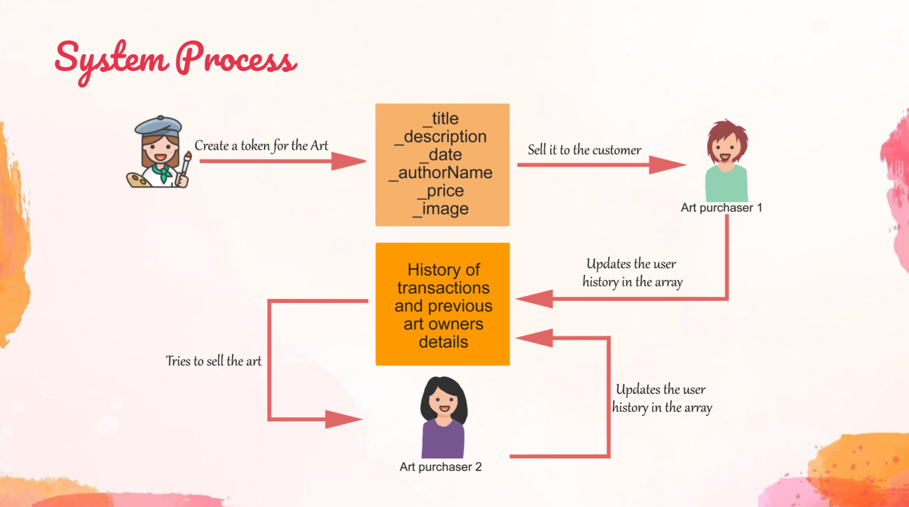
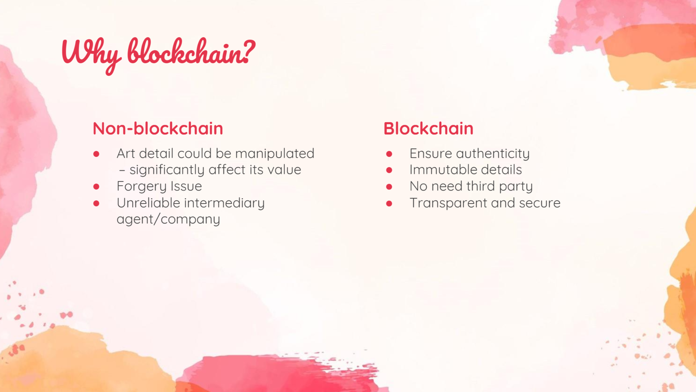

## Artech demo
 

-- 
### slides






--
### Instructions to run the app

Before running the DApp , make sure to install and run ganache-cli [make sure it is hosted in http://127.0.0.1:7545]<br/>
In the main folder ,run these followng commands

        truffle migrate
        
The smart contracts will be deployed to ganache<br/>

Navigate to dapp folder and run these commands<br/>

        npm install
        npm audit fix (if shows error)
        npm run-script startall
      
        
   Note:In previous command , we run 2 scripts parallel for express and react with the help of npm-run-all , as seen in package.json<br/>
   ```
     "scripts": {
      "start": "react-scripts start",
      "build": "react-scripts build",
      "test": "react-scripts test",
      "eject": "react-scripts eject",
      "nodeserver": "nodemon server.js",
      "startall": "run-p nodeserver start"
     }
  ```
  The React app will be hosted on http://localhost:3000/ and node-express on http://locahost:8000/ (it is used to store the uploaded image in the local drive).<br/>
  
   
  ---
 
